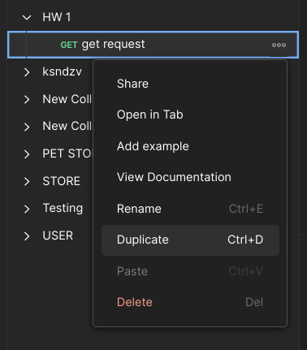
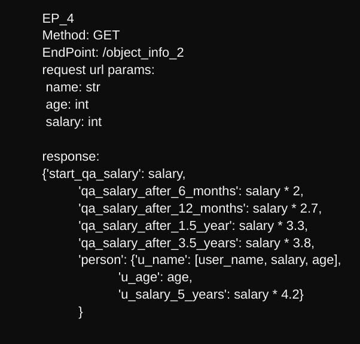
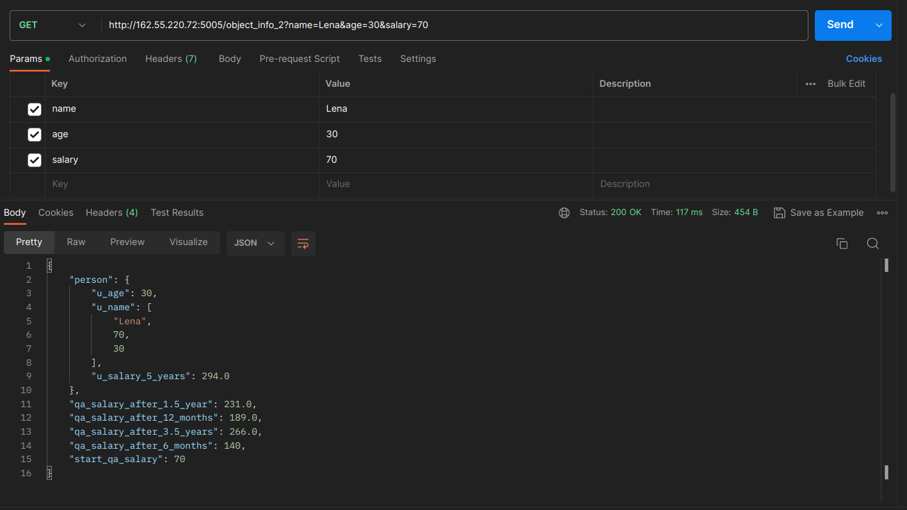
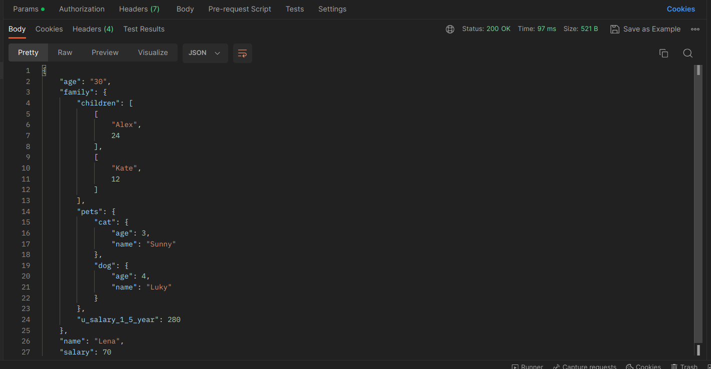
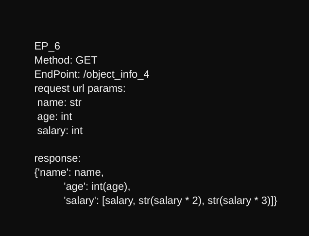
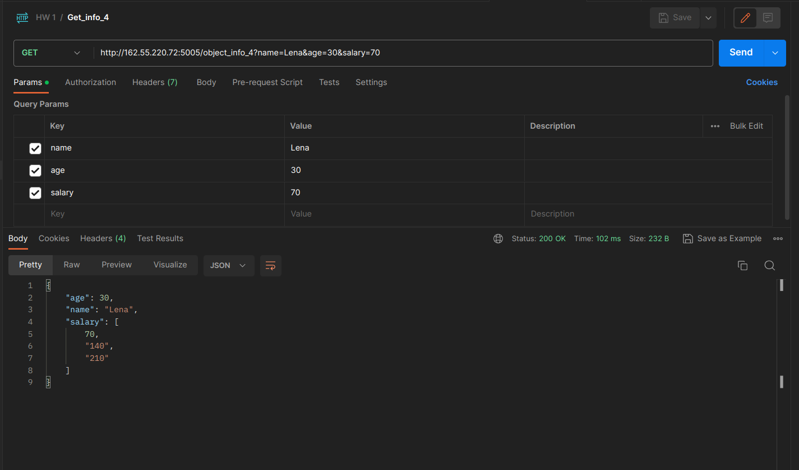

## Create requests in Postman.

### Protocol: ```http```
### IP: ```162.55.220.72```
### Port: ```5005```


## 1. Get request:
 

#### Create new collection through ```+``` with name ```HW 1```
#### In the current collection, create requests in Postman, click on ``` add a request``` and name``` get request```
#### Choose ```get``` method
#### In the ```Enter URL or paste text field```, enter: 
#### ```Protocol, IP, Port and EndPoint```
#### In ```Params``` enter: ```name and age```


## 2. Post request:


#### Click on ```Duplicate``` 
 
#### Change the request name to ```post request```
#### Choose ```post```method
#### In the ```Enter URL or paste text field```, enter: ```Protocol, IP, Port and EndPoint```
#### In `form-date` enter data as documentation


## 3. Get method, EndPoint: `/object_info_1`
 
#### Click on `...` then `add request`
#### Choose `Get` method
#### In the `Enter URL or paste text field`, enter: `Protocol, IP, Port and EndPoint`
### In `Params` enter data as documentation
 

## 4. Method: GET, EndPoint: `/object_info_2`
 

#### Click on `Duplicate`
#### In the `Enter URL or paste text field`, enter: `Protocol, IP, Port and EndPoint`
### In `Params` enter data as documentation


## 5. Method: GET, EndPoint: `/object_info_3`


 
#### Click on `Duplicate`
#### In the `Enter URL or paste text field`, enter: `Protocol, IP, Port and EndPoint`
### In  `Params` enter data as documentation
 
 

## 6. Method: GET, EndPoint: `/object_info_4`

 
#### Click on `Duplicate`
#### In the `Enter URL or paste text field`, enter: `Protocol, IP, Port and EndPoint`
### In `Params` enter data as documentation
 

## 7. Method: POST, EndPoint: `/user_info_2`


#### Click on `...` then `add request`
#### Choose `POST` method
#### In the `Enter URL or paste text field`, enter: `Protocol, IP, Port and EndPoint`
### In `Params` enter data as documentation

 


